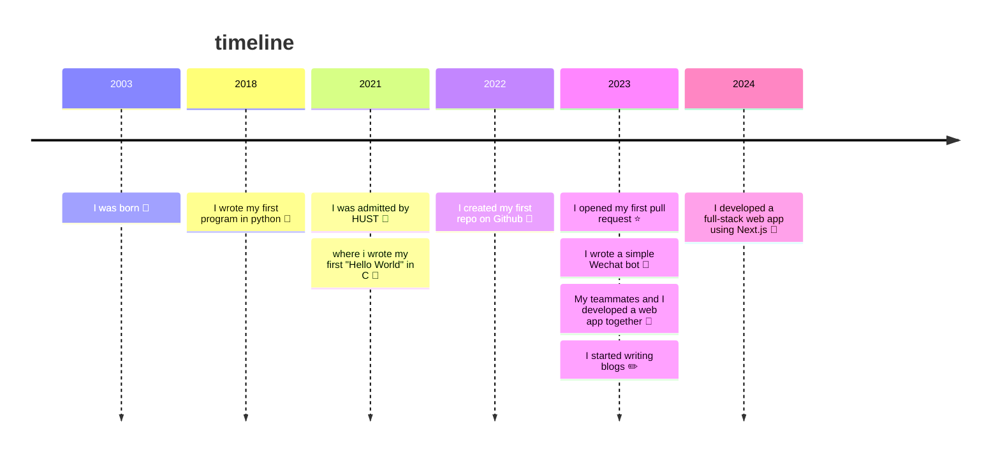

<h2>
  <picture>
    <source srcset="https://fonts.gstatic.com/s/e/notoemoji/latest/1f44b/512.webp" type="image/webp">
    
  </picture>
   Hi there!
</h2>

<table>
  <tr>
    <td>
      <ul>
        <li>🌱 I'm currently studying at HUST.</li>
        <li>⚡️ I like
          <ul>
            <li>🛸 Sci-Fi</li>
            <li>🧑‍💻 Coding</li>
            <li>🐱 Cats</li>
          </ul>
        </li>
      </ul>
    </td>
    <td>
      <a>
        
      </a>
    </td>
  </tr>
</table>

<h2>
  <picture>
    <source srcset="https://fonts.gstatic.com/s/e/notoemoji/latest/1f42c/512.webp" type="image/webp">
    
  </picture>
  More about me
</h2>

```json
{
  "pronouns": ["he", "him"],
  "language": ["cn", "en"],
  "coding-language" : ["js","cpp","python","java"],
  "tools": ["vscode", "docker"]
}
```



<h2>
  <picture>
    <source srcset="https://fonts.gstatic.com/s/e/notoemoji/latest/270f_fe0f/512.webp" type="image/webp">
    
  </picture>
  Latest Posts
</h2>

<!-- BLOG-POST-LIST:START -->
- [Next.js 全栈开发踩坑记](https://yiipu.github.io/posts/next-fullstack/)
- [量子计算科普文章随记](https://yiipu.github.io/posts/reading-qcvc/)
- [用 C++ 实现一个高精度整数类](https://yiipu.github.io/posts/high-percision/)
- [在 WSL 下进行 FPGA 开发](https://yiipu.github.io/posts/fpga-with-wsl/)
- [Git 团队协作指南](https://yiipu.github.io/posts/git-teamwork/)
<!-- BLOG-POST-LIST:END -->
